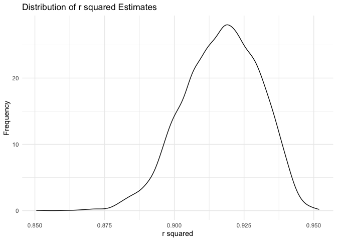
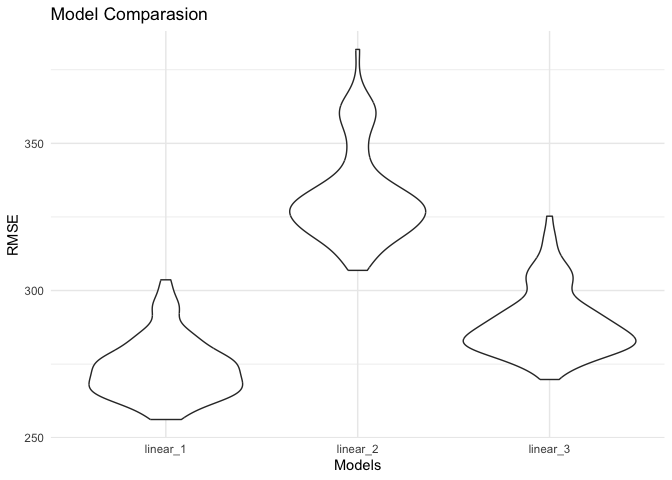

hw6
================
Junjie Hu
2023-12-01

``` r
library(tidyverse)
```

    ## ── Attaching core tidyverse packages ──────────────────────── tidyverse 2.0.0 ──
    ## ✔ dplyr     1.1.3     ✔ readr     2.1.4
    ## ✔ forcats   1.0.0     ✔ stringr   1.5.0
    ## ✔ ggplot2   3.4.3     ✔ tibble    3.2.1
    ## ✔ lubridate 1.9.2     ✔ tidyr     1.3.0
    ## ✔ purrr     1.0.2     
    ## ── Conflicts ────────────────────────────────────────── tidyverse_conflicts() ──
    ## ✖ dplyr::filter() masks stats::filter()
    ## ✖ dplyr::lag()    masks stats::lag()
    ## ℹ Use the conflicted package (<http://conflicted.r-lib.org/>) to force all conflicts to become errors

``` r
library(purrr)
library(modelr)
library(mgcv)
```

    ## Loading required package: nlme
    ## 
    ## Attaching package: 'nlme'
    ## 
    ## The following object is masked from 'package:dplyr':
    ## 
    ##     collapse
    ## 
    ## This is mgcv 1.9-0. For overview type 'help("mgcv-package")'.

# Problem 1

``` r
homicide_df =
  read.csv("homicide-data.csv")|>
  janitor::clean_names() |>
  mutate(city_state = paste(city, state, sep = ",")) |>
  mutate(resolved = ifelse(disposition %in% c("Closed without arrest", "Open/No arrest"), "No", "Yes")) |>
   filter(city_state != "Tulsa,AL" & 
         city_state != "Dallas,TX" & 
         city_state != "Phoenix,AZ" & 
         city_state != "Kansas City,MO") |>
  filter(victim_race %in% c("White", "Black")) |>
  mutate(
    resolved = as.numeric(disposition == "Closed by arrest"),
    victim_age = as.numeric(victim_age),
    victim_race = fct_relevel(victim_race, "White")) |> 
  select(resolved, victim_age, victim_race, victim_sex, city_state)
```

    ## Warning: There was 1 warning in `mutate()`.
    ## ℹ In argument: `victim_age = as.numeric(victim_age)`.
    ## Caused by warning:
    ## ! NAs introduced by coercion

Imported homicide data, created new variable `city_state` and `solved`,
and omit cities Dallas, TX; Phoenix, AZ; and Kansas City, MO.

``` r
baltimore_df =  
  homicide_df |>
  filter(city_state == "Baltimore,MD")


fit_logistic = 
  baltimore_df |> 
  glm(resolved ~ victim_age + victim_race + victim_sex, data = _, family = binomial()) 

fit_logistic |> 
  broom::tidy(conf.int = TRUE) |> 
  mutate(OR = exp(estimate),
         conf.low = exp(conf.low),
         conf.high = exp(conf.high)) |>
  select(term, log_OR = estimate, OR, conf.low, conf.high, p.value) |> 
  knitr::kable(digits = 3)
```

| term             | log_OR |    OR | conf.low | conf.high | p.value |
|:-----------------|-------:|------:|---------:|----------:|--------:|
| (Intercept)      |  1.152 | 3.164 |    1.998 |     5.057 |   0.000 |
| victim_age       | -0.007 | 0.993 |    0.987 |     1.000 |   0.043 |
| victim_raceBlack | -0.842 | 0.431 |    0.305 |     0.606 |   0.000 |
| victim_sexMale   | -0.854 | 0.426 |    0.324 |     0.558 |   0.000 |

Fit a logistic regression for the binary “resolved” outcome and victim
demographics as predictors.

The odds of solving homicide among male victims is 0.426 times compared
to the odds of female victims, adjusting for age and race. We are 95%
confident that the true odds ratio falls between 0.324 and 0.558.

``` r
model_results = 
  homicide_df |> 
  nest(data = -city_state) |> 
  mutate(
    models = map(data, \(df) glm(resolved ~ victim_age + victim_sex + victim_race, 
                             family = binomial(), data = df)),
    tidy_models = map(models, broom::tidy)) |> 
  select(-models, -data) |> 
  unnest(cols = tidy_models) |> 
  mutate(
    OR = exp(estimate), 
    OR_CI_upper = exp(estimate + 1.96 * std.error),
    OR_CI_lower = exp(estimate - 1.96 * std.error)) |> 
  filter(term == "victim_sexMale") |> 
  select(city_state, OR, OR_CI_lower, OR_CI_upper)

model_results |>
  slice(1:5) |> 
  knitr::kable(digits = 3)
```

| city_state     |    OR | OR_CI_lower | OR_CI_upper |
|:---------------|------:|------------:|------------:|
| Albuquerque,NM | 1.767 |       0.831 |       3.761 |
| Atlanta,GA     | 1.000 |       0.684 |       1.463 |
| Baltimore,MD   | 0.426 |       0.325 |       0.558 |
| Baton Rouge,LA | 0.381 |       0.209 |       0.695 |
| Birmingham,AL  | 0.870 |       0.574 |       1.318 |

``` r
model_results |> 
  mutate(city_state = fct_reorder(city_state, OR)) |> 
  ggplot(aes(x = city_state, y = OR)) + 
  geom_point() + 
  geom_errorbar(aes(ymin = OR_CI_lower, ymax = OR_CI_upper)) + 
  theme(axis.text.x = element_text(angle = 90, hjust = 1))
```

<!-- -->

# Problem 2

``` r
weather_df = 
  rnoaa::meteo_pull_monitors(
    c("USW00094728"),
    var = c("PRCP", "TMIN", "TMAX"), 
    date_min = "2022-01-01",
    date_max = "2022-12-31") |>
  mutate(
    name = recode(id, USW00094728 = "CentralPark_NY"),
    tmin = tmin / 10,
    tmax = tmax / 10) |>
  select(name, id, everything())
```

    ## using cached file: /Users/hjj/Library/Caches/org.R-project.R/R/rnoaa/noaa_ghcnd/USW00094728.dly

    ## date created (size, mb): 2023-10-03 10:21:34.279486 (8.525)

    ## file min/max dates: 1869-01-01 / 2023-09-30

Imported data

``` r
boot_sample = function(df) {
  sample_frac(df, replace = TRUE)
}

boot_straps = 
  tibble(strap_number = 1:5000) |> 
  mutate(
    strap_sample = map(strap_number, \(i) boot_sample(df = weather_df))
  )

boot_straps
```

    ## # A tibble: 5,000 × 2
    ##    strap_number strap_sample      
    ##           <int> <list>            
    ##  1            1 <tibble [365 × 6]>
    ##  2            2 <tibble [365 × 6]>
    ##  3            3 <tibble [365 × 6]>
    ##  4            4 <tibble [365 × 6]>
    ##  5            5 <tibble [365 × 6]>
    ##  6            6 <tibble [365 × 6]>
    ##  7            7 <tibble [365 × 6]>
    ##  8            8 <tibble [365 × 6]>
    ##  9            9 <tibble [365 × 6]>
    ## 10           10 <tibble [365 × 6]>
    ## # ℹ 4,990 more rows

Prepared 5000 boot_straps sample for future analysis.

``` r
bootstrap_results = 
  boot_straps |> 
  mutate(
    models = map(strap_sample, \(df) lm(tmax ~ tmin + prcp, data = df) ),
    glance = map(models, broom::glance),
    results = map(models, broom::tidy),
    log_product = map(models, ~log(abs(coef(.x)['tmin'] * coef(.x)['prcp'])))
    ) |> 
    select(-strap_sample, -models, -results) |> 
    unnest(cols = c(glance, log_product))
```

Produced estimates of these two quantities

``` r
bootstrap_results |>
  ggplot(aes(x = r.squared)) +
  geom_density() +
  labs(title = "Distribution of r squared Estimates",
       x = "r squared",
       y = "Frequency") +
  theme_minimal()
```

<!-- --> The distribution
of r squared estimates is normally distributed around 0.920.

``` r
bootstrap_results |>
  ggplot(aes(x = log_product)) +
  geom_density() +
  labs(title = "Distribution of Log_product Estimates",
       x = "Log_product",
       y = "Frequency") +
  theme_minimal()
```

<!-- --> The
distribution of log product estimates is left-skewed. The median is
around -5.

``` r
quantile(pull(bootstrap_results, r.squared), probs = c(0.025, 0.975)) |>
  knitr::kable(digits = 3)
```

|       |     x |
|:------|------:|
| 2.5%  | 0.889 |
| 97.5% | 0.940 |

Quantile for r.squared

``` r
quantile(pull(bootstrap_results, log_product), probs = c(0.025, 0.975)) |>
knitr::kable(digits = 3)
```

|       |      x |
|:------|-------:|
| 2.5%  | -8.528 |
| 97.5% | -4.606 |

Quantile for log_product

# Problem 3

``` r
birthweight_df =
  read.csv("birthweight.csv")|>
  janitor::clean_names() |>
  mutate(
    babysex = recode(babysex,
                     "1" = "male",
                     "2" = "female"),
    frace = recode(frace,
                   "1" = "White",
                   "2" = "Black",
                   "3" = "Asian",
                   "4" = "Puerto Rican",
                   "8" = NA_character_,
                   "9" = NA_character_),
    malform = recode(malform,
                     "0" = "absent",
                     "1" = "present"),
    mrace = recode(mrace,
                   "1" = "White",
                   "2" = "Black",
                   "3" = "Asian",
                   "4" = "Puerto Rican",
                   "8" = NA_character_)
  ) |>
    mutate(
    babysex = as.factor(babysex),
    frace = as.factor(frace),
    malform = as.factor(malform),
    mrace = as.factor(mrace)
  ) 
```

Converted numeric variables to factor and specified names. Those who
answered “Others” and “Unknown” for father race is coded as missing and
excluded from the regression. Those who answered “Others” for mother
race is coded as missing and excluded from the regression.

``` r
unique(birthweight_df$pnumgsa)
```

    ## NULL

``` r
unique(birthweight_df$pnumlbw)
```

    ## [1] 0

Variables `pnumgsa` and `pnumlbw` are excluded from the analysis,
because all observation is “0” for these two variables.

``` r
variables = c("babysex","bhead","blength","delwt","fincome","frace","gaweeks","malform","menarche","mheight","momage","mrace","parity","ppbmi","ppwt","smoken","wtgain")

fit_and_summarize <- function(var) {
  model = lm(as.formula(paste("bwt ~", var)), data = birthweight_df) |>
  
  broom::tidy()
}

model_summaries = 
  map(variables, fit_and_summarize) |>
  bind_rows() |>
  filter(p.value <= 0.05 & term != "(Intercept)")

model_summaries
```

    ## # A tibble: 14 × 5
    ##    term        estimate std.error statistic   p.value
    ##    <chr>          <dbl>     <dbl>     <dbl>     <dbl>
    ##  1 babysexmale    88.8     15.5        5.73 1.08e-  8
    ##  2 bhead         236.       3.19      74.0  0        
    ##  3 blength       140.       1.91      73.2  0        
    ##  4 delwt           6.64     0.335     19.8  1.22e- 83
    ##  5 fincome         3.05     0.296     10.3  1.26e- 24
    ##  6 fraceBlack   -208.      73.0       -2.85 4.42e-  3
    ##  7 gaweeks        66.9      2.25      29.8  9.69e-178
    ##  8 mheight        37.0      2.87      12.9  2.18e- 37
    ##  9 momage         17.9      1.99       9.03 2.57e- 19
    ## 10 mraceBlack   -190.      75.4       -2.52 1.17e-  2
    ## 11 ppbmi          15.1      2.43       6.22 5.56e- 10
    ## 12 ppwt            4.65     0.379     12.3  5.69e- 34
    ## 13 smoken         -5.23     1.05      -5.00 6.07e-  7
    ## 14 wtgain         11.6      0.688     16.8  1.73e- 61

Conducted bivariate analysis to identify the variables that are
significantly associated with birth weight. The significant variables (p
values \<= 0.05) are included to the final multivariate model.

``` r
fit_model = lm(bwt ~ babysex + bhead + blength + delwt + fincome + frace + gaweeks 
                 + mheight + momage + mrace + ppbmi + ppwt + smoken + wtgain, data = birthweight_df)
```

Fitted the significant variables in bivariate analysis to a multivariate
model.

``` r
birthweight_df |> 
  modelr::add_residuals(fit_model) |> 
  modelr::add_predictions(fit_model) |>
  ggplot(aes(x = pred, y = resid)) + 
  geom_point() +
  labs(title = "Model Residuals against Predicted Birth Weight",
       x = "Predicted Birth Weight",
       y = "Residual") +
  theme_minimal()
```

    ## Warning in predict.lm(model, data): prediction from rank-deficient fit; attr(*,
    ## "non-estim") has doubtful cases

    ## Warning in predict.lm(model, data): prediction from rank-deficient fit; attr(*,
    ## "non-estim") has doubtful cases

    ## Warning: Removed 14 rows containing missing values (`geom_point()`).

<!-- -->

There is a few outliers. But, in general, the residual is evenly spread
out around zero. Hence, the model should be able to successfully predict
the birth weight.

``` r
cv_df =
  crossv_mc(birthweight_df, 100) |> 
  mutate(
    train = map(train, as_tibble),
    test = map(test, as_tibble))

cv_df = 
  cv_df |> 
  mutate(
    
    linear_1 = map(train, \(df) lm(bwt ~ babysex + bhead + blength + delwt + fincome + frace + gaweeks + mheight + momage + mrace + ppbmi + ppwt + smoken + wtgain, data = df)),
    
    linear_2 = map(train, \(df) lm(bwt ~ blength + gaweeks, data = df)),
    
    linear_3  = map(train, \(df) lm(bwt ~ bhead + blength + babysex + bhead*blength + blength*babysex + bhead*babysex + bhead*blength*babysex, data = as_tibble(df)))
    ) |> 
  mutate(
    rmse_linear_1 = map2_dbl(linear_1, test, \(mod, df) rmse(model = mod, data = df)),
    rmse_linear_2 = map2_dbl(linear_2, test, \(mod, df) rmse(model = mod, data = df)),
    rmse_linear_3 = map2_dbl(linear_3, test, \(mod, df) rmse(model = mod, data = df)))
```

    ## Warning: There were 100 warnings in `mutate()`.
    ## The first warning was:
    ## ℹ In argument: `rmse_linear_1 = map2_dbl(...)`.
    ## Caused by warning in `predict.lm()`:
    ## ! prediction from rank-deficient fit; attr(*, "non-estim") has doubtful cases
    ## ℹ Run `dplyr::last_dplyr_warnings()` to see the 99 remaining warnings.

``` r
cv_df |> 
  select(starts_with("rmse")) |> 
  pivot_longer(
    everything(),
    names_to = "model", 
    values_to = "rmse",
    names_prefix = "rmse_") |> 
  mutate(model = fct_inorder(model)) |> 
  ggplot(aes(x = model, y = rmse)) + 
  geom_violin() +
  labs(title = "Model Comparasion",
       x = "Models",
       y = "RMSE") +
  theme_minimal()
```

<!-- --> My model have
the lowest RMSE, following my model 3. The highest RMSE is model 2.

Linear 1: My model

Linear 2: Using length at birth and gestational age as predictors (main
effects only)

Linear 3: Using head circumference, length, sex, and all interactions
(including the three-way interaction)
